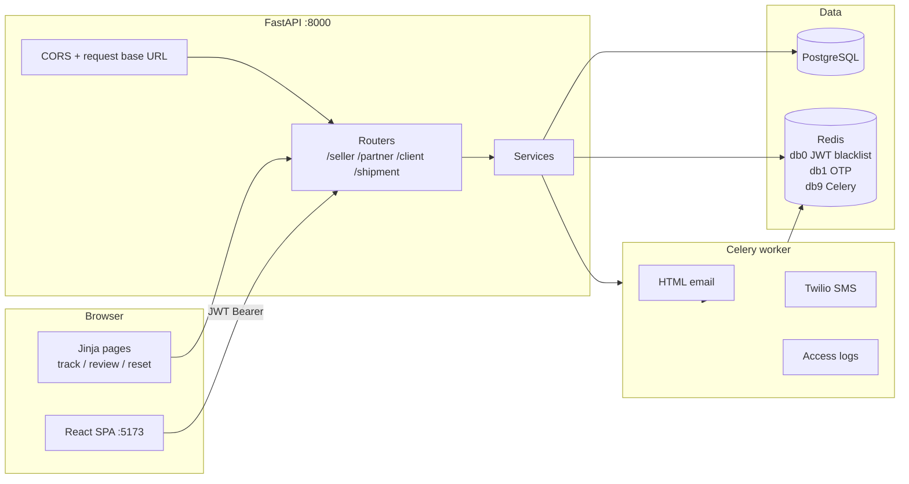
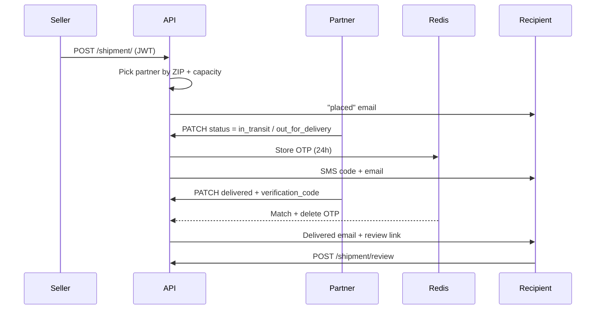
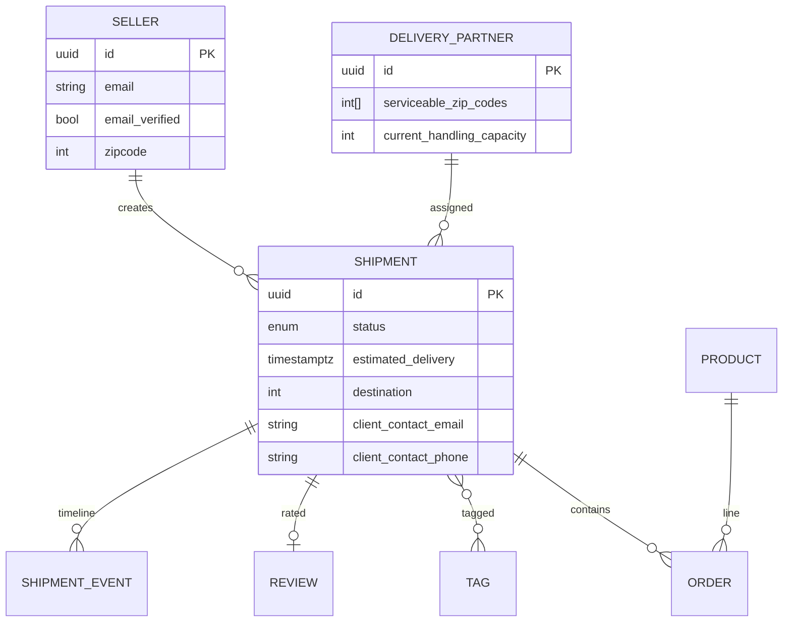

<div align="center">

```
███████╗ █████╗ ███████╗████████╗███████╗██╗  ██╗██╗██████╗
██╔════╝██╔══██╗██╔════╝╚══██╔══╝██╔════╝██║  ██║██║██╔══██╗
█████╗  ███████║███████╗   ██║   ███████╗███████║██║██████╔╝
██╔══╝  ██╔══██║╚════██║   ██║   ╚════██║██╔══██║██║██╔═══╝
██║     ██║  ██║███████║   ██║   ███████║██║  ██║██║██║
╚═╝     ╚═╝  ╚═╝╚══════╝   ╚═╝   ╚══════╝╚═╝  ╚═╝╚═╝╚═╝
                    INSERT COIN TO TRACK
```

**Retro pixel-art shipment tracking — from seller drop-off to doorstep OTP.**

[](https://github.com/Ailesh69/FastShip)
[](frontend/fastship-app)
[](docker-compose.yml)
[](docker-compose.yml)
[](#license)

[Features](#features) · [Architecture](#architecture) · [Roles](#three-roles-one-pipeline) · [API](#http-api) · [Setup](#getting-started) · [Docker](#run-with-docker)

</div>

---

## What FastShip is

FastShip is a full-stack delivery platform with a CRT-era frontend and a production-minded API. Sellers create parcels, partners covering the destination ZIP are assigned automatically, recipients get status emails and a public tracking page, and delivery is locked behind a one-time SMS code.

The UI is not a generic dashboard skin. It is a self-hosted pixel typeface, a perspective floor grid, 8-bit sprites, and a one-shot cinematic intro — designed so the product *looks* like the logistics game it is.

| Layer | Stack |
| :--- | :--- |
| SPA | React 19, Vite 8, Tailwind CSS 4, React Router 7, Axios |
| API | FastAPI, SQLModel / SQLAlchemy 2 (async), Pydantic Settings |
| Data | PostgreSQL 17, Alembic migrations, Redis 7 |
| Jobs | Celery workers (mail templates, SMS with backoff) |
| Auth | JWT per role, bcrypt, Redis JTI blacklist, signed URL tokens |
| Notify | FastAPI-Mail (Jinja HTML), Twilio OTP |
| Ship | Multi-stage Python 3.14 image + Compose (db, redis, backend, worker) |

API docs live at **`/docs`** (Swagger), **`/redoc`**, and **`/scalar`**. Health check: `GET /` → `{ "detail": "Server is running" }`.

---

## Features

### Logistics
- **Auto-assign partners** by destination ZIP against each partner’s `serviceable_zip_codes`, skipping anyone whose handling capacity is exhausted (`406` if nobody can take it).
- **Timeline, not a flag.** Status lives on `ShipmentEvent` rows; the shipment column is kept in lockstep so dashboards and capacity filters stay honest.
- **Default ETA** of three days from creation, stored as `TIMESTAMP WITH TIME ZONE`.
- **Tags** seeded on boot: `EXPRESS`, `STANDARD`, `FRAGILE`, `HEAVY`, `INTERNATIONAL`, `RETURN` — seller-scoped add / remove / list.
- **Weight cap** of 25 (schema-enforced). At least one of recipient email or phone is required.

### Trust & delivery
- Email verification and password reset via signed, expiring tokens (links are built from `APP_BASE_URL` or, on loopback, from the request `Host` so LAN devices work).
- Logout blacklists the JWT `jti` in Redis.
- **Out for delivery** issues a Redis OTP (24h TTL). Marking **delivered** requires that code; it is burned on success so it cannot be replayed.
- Public **HTML tracking** (`GET /shipment/track`) — the page emailed links open. The JSON `GET /shipment/` is partner-authenticated so contact details never leak from a tracking UUID.
- Post-delivery **review** page (1–5 stars + comment) behind a signed token.

### Interface
- Role-aware SPA: client, seller, and delivery partner each have signup, dashboard, and profile routes.
- Pixel design tokens (`#0a1128` navy, neon green, teal, gold) with Press Start 2P + VT323 **self-hosted** as `woff2` — no Google Fonts at runtime.
- Motion: a single depth engine publishes CSS variables; magnetic CTAs, warp/loading overlays, and a session-once intro.

---

## Architecture



**Request path.** The SPA talks to the API with Axios (`VITE_API_BASE_URL`, default `http://localhost:8000`). Tracking and review are **server-rendered** so an email on a phone works without loading Vite. Static fonts for those pages are mounted at `/static`.

**Why Redis is three databases.** Logout tokens, delivery OTPs, and the Celery broker must not collide. OTPs expire in 24 hours; access logging is best-effort — a down broker never fails the HTTP response.

---

## Three roles, one pipeline



| Role | Signs up at | After login | Can do |
| :--- | :--- | :--- | :--- |
| **Client** | `/client/signup` | `/client/dashboard` | Account + profile; consume tracking / review links |
| **Seller** | `/seller/signup` | `/seller/dashboard` | Create / cancel shipments, tags, see assigned partner name |
| **Partner** | `/partner/signup` | `/partner/dashboard` | Update status & location, confirm delivery with OTP, edit ZIP coverage & capacity |

Login is OAuth2 password grant on `/client/token`, `/seller/token`, `/partner/token`. Email must be verified first (or use the local helper in [Scripts](#scripts)).

**Shipment states**

```
placed → in_transit → out_for_delivery → delivered
                ↘ cancelled
```

---

## Domain model



SQLModel table classes live under `schemas/` (not a separate ORM package). `Database/session.py` creates tables on API startup and **seeds missing tags** every boot so tag endpoints never hit an empty vocabulary.

---

## HTTP API

Prefix summary. Full schemas and examples are in Scalar / OpenAPI.

<details>
<summary><strong>Seller</strong> <code>/seller</code></summary>

| Method | Path | Auth | Purpose |
| :--- | :--- | :--- | :--- |
| `POST` | `/register` | — | Create seller, send verify email |
| `POST` | `/token` | — | Login → bearer JWT |
| `GET` | `/verify` | token query | Confirm email |
| `GET` | `/` | seller | Current profile |
| `GET` | `/shipments` | seller | Own shipments |
| `GET` | `/logout` | seller | Blacklist JTI |
| `GET` | `/forgot_password` | — | Mail reset link |
| `GET`/`POST` | `/reset_password` | signed token | HTML form + submit |

</details>

<details>
<summary><strong>Delivery partner</strong> <code>/partner</code></summary>

| Method | Path | Auth | Purpose |
| :--- | :--- | :--- | :--- |
| `POST` | `/register` | — | Create partner (ZIPs + capacity) |
| `POST` | `/token` | — | Login |
| `GET` | `/verify` | token query | Confirm email |
| `GET` | `/` | partner | Profile |
| `POST` | `/` | partner | Update profile (coverage, capacity, …) |
| `GET` | `/shipments` | partner | Assigned shipments |
| `GET` | `/logout` | partner | Blacklist JTI |
| `GET`/`POST` | password reset | signed token | Same pattern as seller |

</details>

<details>
<summary><strong>Client</strong> <code>/client</code></summary>

| Method | Path | Auth | Purpose |
| :--- | :--- | :--- | :--- |
| `POST` | `/register` | — | Create client |
| `POST` | `/token` | — | Login |
| `GET` | `/verify` | token query | Confirm email |
| `GET` | `/` | client | Profile |
| `GET` | `/logout` | client | Blacklist JTI |
| `GET`/`POST` | password reset | signed token | Same pattern as seller |

</details>

<details>
<summary><strong>Shipment</strong> <code>/shipment</code></summary>

| Method | Path | Auth | Purpose |
| :--- | :--- | :--- | :--- |
| `POST` | `/` | seller | Create + auto-assign partner (`201` / `406`) |
| `GET` | `/?id=` | partner | Full JSON including contacts & timeline |
| `GET` | `/track?id=` | public | HTML tracking page |
| `PATCH` | `/?id=` | assigned partner | Status / location; OTP required for `delivered` |
| `POST` | `/cancel?id=` | owning seller | Cancel |
| `POST` | `/tag` | owning seller | Attach `TagName` |
| `DELETE` | `/tag` | owning seller | Remove tag |
| `GET` | `/all_tags` | seller | That seller’s shipments with a given tag |
| `GET`/`POST` | `/review` | signed token | HTML form + submit rating |

</details>

Custom errors (`EntityNotFound`, `BadCredentials`, `ClientNotAuthorized`, `DeliveryPartnerNotAvailable`, `Conflict`, …) are registered in `core/exception.py` so the client sees a string `detail`, not a stack trace.

---

## Frontend map

| Route | Screen |
| :--- | :--- |
| `/` | Hero, cinematic intro (once per session), **INSERT COIN** |
| `/about` | About |
| `/login` `/signup` | Auth + role picker |
| `/client|seller|partner/signup` | Role forms |
| `/client/dashboard` `/client/profile` | Client area |
| `/seller/dashboard` `/seller/submit-shipment` `/seller/profile` | Seller area |
| `/partner/dashboard` `/partner/update-shipment` `/partner/profile` | Partner area |
| `/track` | Lookup that **leaves the SPA** for `/shipment/track` |
| `*` | Real 404 (not a silent redirect home) |

Protected prefixes bounce to `/login`. Bearer tokens are read from `localStorage` on every Axios call so another tab’s logout takes effect immediately.

Optional: set `VITE_API_BASE_URL` and `VITE_SITE_URL` for a non-localhost API and for canonical / Open Graph tags emitted by `seoPlugin.js`.

---

## Repository layout

```
FastShip/
├── main.py                 # FastAPI app, CORS, lifespan, /scalar, /static
├── config.py               # Settings from .env (DB, JWT, mail, Twilio, CORS)
├── docker-compose.yml      # Postgres, Redis, API, Celery worker
├── Dockerfile              # Multi-stage Python 3.14 slim
├── alembic.ini / migrations/
├── api/                    # Routers + JWT dependencies per role
├── core/                   # Security schemes, exceptions, request host
├── Database/               # Engine, Redis clients, ShipmentStatus enum
├── schemas/                # SQLModel tables + Pydantic I/O
├── services/               # Domain logic (assign, OTP, mail hooks)
├── worker/tasks.py         # Celery: mail, SMS retries, access log
├── templates/              # Jinja: emails + tracking / review / reset pages
├── static/fonts/           # Same pixel faces the SPA ships
├── Testing/                # pytest + httpx ASGI client, isolated test DB
├── scripts/verify_account.py
└── frontend/fastship-app/  # Vite React client
```

---

## Getting started

### Prerequisites

- Python **3.12+** (Compose image is **3.14**)
- Node.js **20+** (for the SPA)
- PostgreSQL 17 and Redis 7 — or Docker, which provides both

### 1. Clone and configure

```bash
git clone https://github.com/Ailesh69/FastShip.git
cd FastShip
cp .env.example .env
```

Fill `.env` at least with Postgres credentials, `JWT_SECRET`, and mail/Twilio if you want real notifications.

Generate a signing key:

```bash
python -c "import secrets; print(secrets.token_hex(32))"
```

### 2. API (native)

```bash
python -m venv .venv
source .venv/bin/activate          # Windows: .venv\Scripts\activate
pip install -r requirements.txt

# Postgres + Redis must be reachable at the hosts in .env
uvicorn main:app --reload --host 0.0.0.0 --port 8000
```

In another terminal, the worker (required for mail, SMS, and queued access logs):

```bash
celery -A worker.tasks worker --loglevel=info
```

Schema: the API calls `create_all` on boot. For an existing database, use Alembic:

```bash
alembic upgrade head
```

### 3. SPA

```bash
cd frontend/fastship-app
npm install
npm run dev
```

Open **http://localhost:5173**. The API origin must appear in `CORS_ORIGINS` (default `http://localhost:5173`).

### 4. Verify an account without email (local only)

```bash
python -m scripts.verify_account --list seller
python -m scripts.verify_account seller you@example.com
```

Roles: `seller` | `partner` | `client`.

### Email links and other devices

`APP_BASE_URL` is the address **the recipient’s device** must resolve.

| Situation | What to do |
| :--- | :--- |
| Same machine | Default `http://localhost:8000` is fine |
| Same Wi-Fi | Bind `0.0.0.0:8000`, open the LAN IP, add that origin to `CORS_ORIGINS` |
| Anywhere else | Tunnel (`cloudflared` / `ngrok`) and **pin** `APP_BASE_URL` to the public HTTPS URL |

A non-loopback `APP_BASE_URL` always wins over the request Host. A loopback value falls back to the Host header so a phone on your LAN gets LAN links, not `localhost`.

---

## Run with Docker

```bash
cp .env.example .env   # still required — Compose passes it into the API and worker
docker compose up --build
```

| Service | Role |
| :--- | :--- |
| `db` | Postgres 17, volume `postgres_data`, port `${POSTGRES_PORT:-5432}` |
| `redis` | Redis 7, volume `redis_data` |
| `backend` | Uvicorn on **8000**; `POSTGRES_SERVER=db`, `REDIS_HOST=redis` |
| `worker` | Same image, `celery -A worker.tasks worker` |

The frontend is **not** in Compose (see `.dockerignore`). Keep `npm run dev` (or a static host) pointed at `http://localhost:8000`.

---

## Environment

Copied from [`.env.example`](.env.example). Empty secrets fail closed — do not commit `.env`.

| Variable | Used for |
| :--- | :--- |
| `POSTGRES_SERVER` `PORT` `USER` `PASSWORD` `DB` | Async SQLAlchemy URL |
| `POSTGRES_TEST_DB` | Isolated pytest database |
| `REDIS_HOST` `REDIS_PORT` | Blacklist, OTP, Celery |
| `JWT_SECRET` `JWT_ALGORITHM` | Access tokens (`HS256`) |
| `APP_BASE_URL` | Email / tracking / font URLs |
| `CORS_ORIGINS` | Comma-separated browser origins |
| `MAIL_*` | SMTP (Gmail defaults: port 587, STARTTLS) |
| `TWILIO_SID` `TWILIO_AUTH_TOKEN` `TWILIO_PHONE_NUMBER` | Delivery OTP SMS |

---

## Tests

```bash
# Requires Postgres with POSTGRES_TEST_DB created, plus Redis for anything that touches OTP/JWT
pytest Testing/
```

`Testing/conftest.py` builds a session-scoped ASGI client, creates tables on the test DB, seeds `Testing/example.py` data, and drops the schema afterward. Login fixtures hit `/seller/token` (OAuth2 form), not a non-existent `/login`.

---

## Design tokens

| Token | Hex | Role |
| :--- | :--- | :--- |
| `fs-bg` | `#0a1128` | Navy canvas |
| `fs-grid` | `#1e6f7a` | Perspective grid |
| `fs-green` / `fs-green-hot` | `#7de87e` / `#39ff14` | Primary CTAs, glow |
| `fs-teal` | `#22d3ee` | Borders, PRESS START |
| `fs-gold` | `#fbbf24` | Stats, accents |
| `fs-orange` | `#f97316` | Dashed frames |
| `fs-ink` | `#e2e8f0` | Body copy |

Type: **Press Start 2P** (UI) and **VT323** (terminal), SIL OFL, shipped under `frontend/fastship-app/public/fonts` and `static/fonts`.

---

## Scripts

| Command | Purpose |
| :--- | :--- |
| `python -m scripts.verify_account ROLE EMAIL` | Flip `email_verified` for local login |
| `alembic revision --autogenerate -m "…"` | New migration |
| `alembic upgrade head` | Apply migrations |
| `npm run build` (in `frontend/fastship-app`) | Production SPA + SEO HTML per public route |

---

## Security notes

- `.env` is gitignored. Only `.env.example` is the template.
- JSON shipment fetch is partner-authenticated; public tracking is HTML without recipient PII.
- Tags and cancel are scoped to the owning seller.
- Delivery confirmation uses `hmac.compare_digest` against Redis; missing OTP is a failed check, not the string `"None"`.
- Twilio send retries only on 429 / 5xx. Auth and invalid-number errors are not retried.
- Passwords are bcrypt (72-byte truncate, matching historical passlib hashes).
Note: Email/SMS notifications require a Celery worker. 
Run locally with `celery -A worker.tasks worker` for full functionality.
---

## License

No license file is published in this repository. All rights reserved by the author unless you add one. Ask before you reuse the code in another product.

---

<div align="center">

**PRESS START** — then keep the worker running, or the mail never leaves the dock.

[github.com/Ailesh69/FastShip](https://github.com/Ailesh69/FastShip)

</div>
